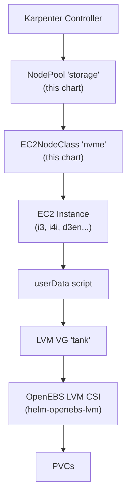

# karpenter-nvme

Helm chart that creates Karpenter [EC2NodeClass](https://karpenter.sh/docs/concepts/nodeclasses/) and [NodePool](https://karpenter.sh/docs/concepts/nodepools/) resources for provisioning EC2 instances with NVMe instance store drives. The userData script automatically installs LVM2, discovers all NVMe devices, and creates a volume group for use with [OpenEBS LVM LocalPV](https://openebs.io/docs).

This chart does **not** install Karpenter itself — it creates CRD instances that Karpenter manages.

## Prerequisites

- Karpenter v1.0+ deployed with CRDs installed
- IAM node role with required EC2/EKS policies
- Subnets tagged with `karpenter.sh/discovery: <clusterName>`
- Security group tagged with `Name: <securityGroupTag>`

## Quick Start

```bash
helm upgrade --install karpenter-nvme oci://ghcr.io/noizu-labs/karpenter-nvme \
  --namespace karpenter \
  --set nodeRole=my-node-role \
  --set clusterName=my-cluster \
  --set securityGroupTag=my-sg \
  --wait
```

## Values

| Parameter | Default | Description |
|-----------|---------|-------------|
| `nodeRole` | `""` | **Required.** IAM role name for EC2 nodes |
| `clusterName` | `""` | **Required.** EKS cluster name (for subnet discovery) |
| `securityGroupTag` | `""` | **Required.** `Name` tag value on the node security group |
| `volumeGroup` | `tank` | LVM volume group name created by userData |
| `amiAlias` | `al2023@latest` | AMI selector alias |
| `blockDevice.volumeSize` | `20Gi` | Root EBS volume size |
| `blockDevice.volumeType` | `gp3` | Root EBS volume type |
| `blockDevice.encrypted` | `true` | Encrypt root EBS volume |
| `nodePool.capacityTypes` | `[spot, on-demand]` | Instance purchase types |
| `nodePool.architectures` | `[amd64]` | CPU architectures |
| `nodePool.minNvmeGiB` | `100` | Minimum NVMe instance store size |
| `nodePool.limits.cpu` | `32` | Max total vCPUs across all nodes |
| `nodePool.limits.memory` | `128Gi` | Max total memory across all nodes |
| `nodePool.consolidateAfter` | `60s` | Consolidation delay |
| `nodePool.weight` | `20` | NodePool scheduling weight |
| `nodePool.disruptionBudget.nodes` | `1` | Max nodes disrupted simultaneously |

## Architecture



## Cross-Chart Dependency

The volume group name (`volumeGroup`, default `tank`) must match across:
- This chart
- [helm-openebs-lvm](https://github.com/noizu-labs/helm-openebs-lvm) (`storageClass.volumeGroup`)
- [helm-storage-consolidator](https://github.com/noizu-labs/helm-storage-consolidator) (`storageClass`)

## License

MIT - see [LICENSE](LICENSE)
