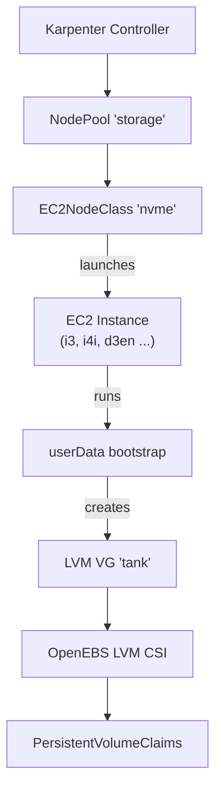

# Project Architecture

## Overview

`karpenter-nvme` is a Helm chart that provisions Karpenter EC2NodeClass and NodePool CRD instances for EC2 nodes with NVMe instance store drives. It does not install Karpenter itself — it declares the node provisioning policy that Karpenter's controller reconciles. A userData bootstrap script discovers NVMe devices at instance launch and assembles them into an LVM volume group consumed by OpenEBS LVM LocalPV.

## System Diagram

## Core Components

| Component | Resource | Purpose |
|-----------|----------|---------|
| EC2NodeClass | `templates/ec2nodeclass.yaml` | Defines AMI, subnets, security groups, root EBS, and userData bootstrap |
| NodePool | `templates/nodepool.yaml` | Scheduling constraints: capacity type, arch, NVMe minimum, limits, disruption |
| Helpers | `templates/_helpers.tpl` | Shared label set for all resources |

## userData Bootstrap

The EC2NodeClass embeds a multipart MIME userData script that runs at instance launch. It installs LVM2, loads `dm_thin_pool`, discovers NVMe instance store devices via sysfs model string, creates PVs, and assembles them into a single volume group. OpenEBS manages thin pool creation dynamically at PVC provisioning time.

-> *See [arch/userdata-bootstrap.md](arch/userdata-bootstrap.md) for details*

## Cross-Chart Dependencies

The `volumeGroup` value (default `tank`) is the contract point between three charts. All three must agree on the name for storage to function end-to-end.

-> *See [arch/cross-chart-dependencies.md](arch/cross-chart-dependencies.md) for details*

## CI/CD

Tag-triggered release pipeline packages the chart and pushes to `oci://ghcr.io/noizu-labs`. PR linting validates `helm lint` and `helm template` against test values.

-> *See [arch/ci-cd.md](arch/ci-cd.md) for details*

## Key Decisions

- **LVM over raw block**: LVM enables thin provisioning and dynamic volume carving by OpenEBS, rather than dedicating entire NVMe devices to single workloads.
- **No thin pool in userData**: OpenEBS LVM LocalPV creates thin pools on demand; pre-creating one confuses its capacity reporting.
- **Spot-first capacity**: Default `[spot, on-demand]` ordering prioritizes cost savings for ephemeral-storage workloads that tolerate interruption.
- **sysfs device discovery**: Filters NVMe devices by `Instance Storage` model string rather than device naming conventions, which vary across instance families.
